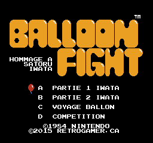
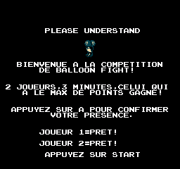
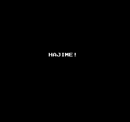
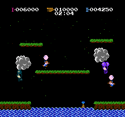
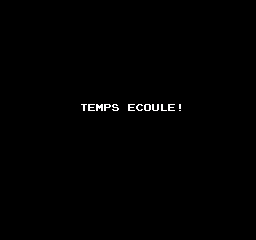
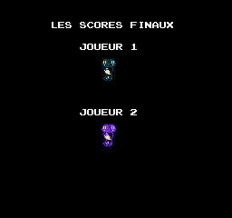
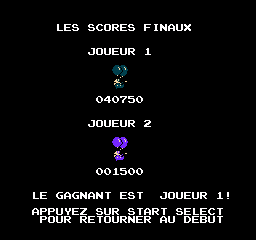

# Balloon Fight - Hommage a Satoru Iwata

This is a ROM modification of the original Balloon Fight that add a new 2 player only gameplay mode where the goal is to make the maximum of points in 3 minutes. It has 2 new screens, the competition info screen and the compeition results screen. It display a custom timer during that mode.

All the text is now in French because it was done for a local retrogaming event in Montreal back in 2015.

The PRG ROM has been expanded from 16Kb to 32 Kb to make space for the new code.









## Original ROM checksum

```
24576 Bytes (0.1875 Mb)

Padded: Maybe, 24 Bytes (0.0002 Mb)
Interleaved/Swapped: No
Backup unit/emulator header: Yes, 16 Bytes
Internal size: 0.1875 Mb
Internal PRG size: 0.1250 Mb
Internal CHR size: 0.0625 Mb
Memory mapper (iNES): 0
Television standard: NTSC
Mirroring: Horizontal
Cartridge RAM: 8 kBytes
Save RAM: No
512-byte trainer: No
VS-System: No
Checksum (CRC32): 0x401349a8
Checksum (SHA1): 0x57f86e49372ae44da79f269973e7db4f443d0b98
```

## Build the hack

1. Copy [uCON64](https://ucon64.sourceforge.io/) and [ASM6](https://www.romhacking.net/utilities/674/
) executables into the checkout.
1. Have the original rom named `balloon_fight.nes` into the checkout.
1. Run `make.bat`, it will do all the required assembly and patching of the original CHR (graphics) file.
1. A `balloon_festival.nes` will be generated alongside the IPS patch.

## External Credits

* Iwata sprite modifications by John Riggs - https://www.youtube.com/watch?v=-8Ur717_T0U
* uCON64 - https://ucon64.sourceforge.io/
* ASM6 - https://www.romhacking.net/utilities/674/
